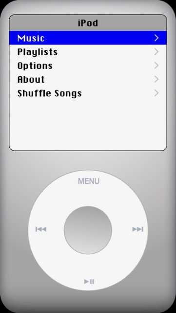

# iPod
Classic looking iPod app for iPhone.
Works using iTunes library on device, need iTunes on phone to test.

Things to do
1. Sort out the screen levels depending on track/album/playlist being played.
2. Stop playing track and clear
3. Click sound on wheel or some tactile feedback
4. Playlists
5. Shuffle
6. Bit of refactor for Swift 4

